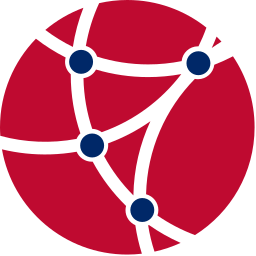

# SyntagNet 1.0 for Open English Wordnet

### What is it ?

OEWN lacks collocation relations, i.e. relations of words + meanings on the
syntagmatic axis.

This brings __collocations__ to OEWN __as sense relations__
(a relation between two words, each within a semantic context
expressed by a synset)

The collocations here are provided by SyntagNet, a manually-curated large-scale lexical-semantic
combination database which associates pairs of concepts with pairs of co-occurring words,
hence capturing sense distinctions evoked by syntagmatic relations.

### License

SyntagNet is licensed under the CC BY-NC-SA 4.0 License.

### Authors

Authors are Marco Maru, Federico Scozzafava, Federico Martelli and Roberto Navigli (Sapienza Università di Roma and Babelscape). This project is funded by the MOUSSE ERC and the ELEXIS project under the European Union's Horizon 2020 research and innovation programme.

### References

Paper: [SyntagNet: Challenging Supervised Word Sense Disambiguation with Lexical-Semantic Combinations](https://aclanthology.org/D19-1359.pdf)

[Site](http://syntagnet.org/)

[About](http://syntagnet.org/about)

[Download SyntagNet](http://syntagnet.org/download)

### Statistics

174768 collocations are added to OEWN (87384+87384, both ways),
616 failed due to 239 senses being obsoleted or some flawed symmetrical source data.

### Tools

The *augment.py* script here adds collocations to the YAML files as sense relations. It does not have any dependency apart from PyYAML.

[oewn-core](https://github.com/oewntk/oewn-core), a base python library for OEWN, has now a 
[oewn-syntagnet](https://github.com/oewntk/oewn-core/tree/main/oewn_syntagnet) module
that allows runtime injection of collocations into the OEWN model.